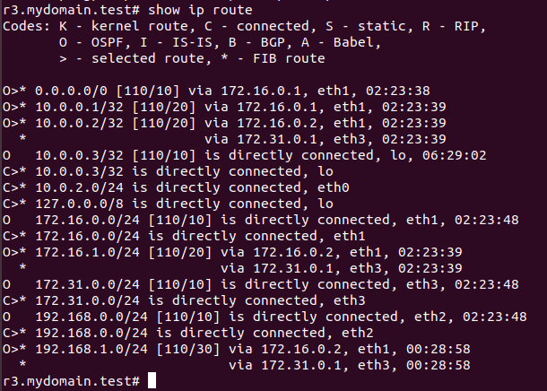
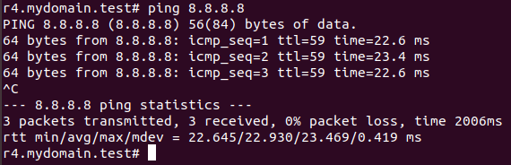

# Выплнение работы
## Подготовка:
Были выполненны подготовительные работы и запущен vagrant файл:


## Выполнение:
### на сервере r1:
Последовательное выполнение комманд:
```bash
sudo vtysh                    # вход в quagga
configure terminal            # вход режим глобальной конфигурации
router ospf                   # вход в режим настройки роутера
router-id  10.0.0.1           # присвоение id роутеру
passive-interface default     # выключение машрута по умолчанию
network 172.16.0.1/24 area 0  # присвоение area 0 сети 172.16.0.1/24
no passive-interface eth1     # включение интерфеса eth1
default-information originate # включение распространения маршрута по умолчанию
exit                          # выход в глобальной конфигурации
exit                          # выход в основной режим
copy running-config startup-config # сохранение новой конфигурации
exit                          # выход в консоль
iptables -t nat -A POSTROUTING -o eth1 -j MASQUERADE  # включение маскарада на интерфейсе eth1
```
#### Проверки r1:
* пинг интернета:


* пинг 192.168.1.2:


* таблица маршрутизации:


* соседи:


### на сервере r2:
Последовательное выполнение комманд:
```bash
sudo vtysh                    # вход в quagga
configure terminal            # вход режим глобальной конфигурации
router ospf                   # вход в режим настройки роутера
router-id  10.0.0.2           # присвоение id роутеру
passive-interface default     # выключение машрута по умолчанию
no passive-interface eth1     # включение интерфеса eth1
network 172.16.0.2/24 area 0  # присвоение area 0 сети 172.16.0.2/24
no passive-interface eth2     # включение интерфеса eth2
network 172.16.1.1/24 area 1  # присвоение area 1 сети 172.16.1.1/24
no passive-interface eth3     # включение интерфеса eth3
network 172.31.0.1/24 area 0  # присвоение area 0 сети 172.31.0.1/24
exit                          # выход в глобальной конфигурации
exit                          # выход в основной режим
copy running-config startup-config # сохранение новой конфигурации
```

#### Проверки:
* пинг интернета:


* пинг 192.168.1.2:


* таблица маршрутизации:


* соседи:


### на сервере r3:
Последовательное выполнение комманд:
```bash
sudo vtysh                    # вход в quagga
configure terminal            # вход режим глобальной конфигурации
router ospf                   # вход в режим настройки роутера
router-id  10.0.0.3           # присвоение id роутеру
passive-interface default     # выключение машрута по умолчанию
no passive-interface eth1     # включение интерфеса eth1
network 172.16.0.3/24 area 0  # присвоение area 0 сети 172.16.0.3/24
no passive-interface eth2     # включение интерфеса eth2
network 192.168.0.1/24 area 0  # присвоение area 1 сети 192.168.0.1/24
no passive-interface eth3     # включение интерфеса eth3
network 172.31.0.3/24 area 0  # присвоение area 0 сети 172.31.0.3/24
exit                          # выход в глобальной конфигурации
exit                          # выход в основной режим
copy running-config startup-config # сохранение новой конфигурации
```
#### Проверки r3:
* пинг интернета:


* пинг 192.168.1.2:


* таблица маршрутизации:


* соседи:


### на сервере r4:
На этом сервере quagga не установленна, поэто, сначала установим её и запустим:
```bash
sudo su
yum install -y quagga           #  установка quagga
systemctl enable zebra.service  #  включение службы
systemctl start zebra.service   #  запуск службы
```
теоритически quagga должна была заработать, но заработала она непойми как. Хорошо, что заново созданый r4 запустился с quagga

Теперь настойка:
```bash
sudo su
vtysh                              # вход в quagga
configure terminal                 # вход режим глобальной конфигурации
router ospf                        # вход в режим настройки роутера
router-id  10.0.0.4                # присвоение id роутеру
passive-interface default          # выключение машрута по умолчанию
no passive-interface eth1          # включение интерфеса eth1
network 172.16.1.2/24 area 1       # присвоение area 0 сети 172.16.1.2/24
no passive-interface eth2          # включение интерфеса eth2
network 192.168.1.1/24 area 1      # присвоение area 1 сети 192.168.1.1/24
exit                               # выход в глобальной конфигурации
exit                               # выход в основной режим
copy running-config startup-config # сохранение новой конфигурации
```
#### проверки
* пинг интернета:


* пинг 192.168.0.2:


* таблица маршрутизации:


* соседи:

