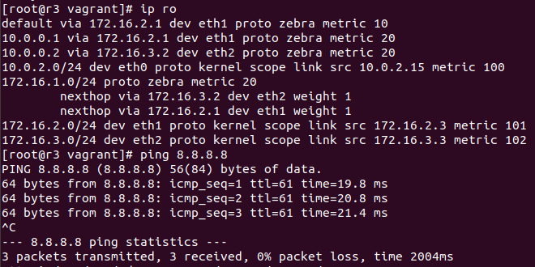

# Выполнение работы
## Подготовка:
Были выполненны подготовительные работы и запущен vagrant файл:


## Выполнение:

### на роутере r1:
Вход в quagga и присвоение id интерфейсу:


Назначение area 0 сети 10.0.0.1/32


Назначение area 0 сетям 172.16.1.0/24 и 172.16.2.0/24:


Включение интерфейсов eth1 и eth2 и сохранение конфигурации:


### на роутере r2:
Вход в quagga и присвоение id интерфейсу:


Выключение интерфейса по умолчанию, назначение area сетям и сохранение конфигурации:


Забыл включить интерфесы eth1 и eth2. Включаю и сохраняю конфигурацию:


### на роутере r3:
На роутере r3, по аналогии с предыдущим, надо выполнить следующие комманды:

```bash
sudo vtysh
configure terminal
router ospf
ospf router-id 10.0.0.3
passive-interface default
no passive-interface eth1
no passive-interface eth2
network 10.0.0.3/32 area 0.0.0.0
network 172.16.2.0/24 area 0.0.0.0
network 172.16.3.0/24 area 0.0.0.0
exit
exit
copy running-config startup-config
```
проверка сохраненной конфигурации:


### на роутере r1:
распространение маршрута по умолчанию:
```default-information originate```

Включение маскарада
```iptables -t nat -A POSTROUTING -o eth0 -j MASQUERADE```

## Проверки

### на роутере r2:
Проверка таблиц маршрутизации и выхода во внешнюю сеть:


### на роутере r3:
Проверка таблиц маршрутизации и выхода во внешнюю сеть:


